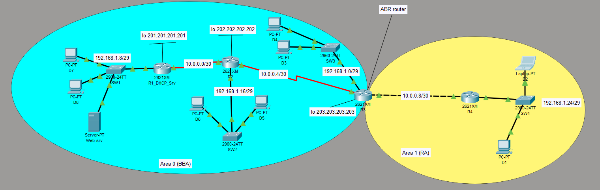

# CCNA Multi-Area OSPF and Centralized DHCP Lab



## Overview

This Cisco Packet Tracer lab documents my practical learning with IPv4 subnetting, centralized DHCP, DHCP relay, and multi-area OSPF. The topology uses **OSPF Area 0** as the backbone and **Area 1** as a remote area, with R3 operating as the Area Border Router (ABR).

A troubleshooting scenario was also completed: clients behind R4 received APIPA addresses because the DHCP server contained overlapping pools for the remote LAN. I traced the DHCP path, validated OSPF reachability, corrected the pool configuration, and restored DHCP service.

## Skills demonstrated

- Configuring single-process, multi-area OSPF
- Verifying OSPF adjacencies and inter-area routes
- Designing '/30' point-to-point networks and '/29' LANs
- Providing centralized DHCP to remote routed networks
- Configuring DHCP relay with 'ip helper-address'
- Troubleshooting APIPA addressing and DHCP pool selection
- Reading routing tables, DHCP bindings, and interface status
- Documenting a repeatable troubleshooting process

## Topology and addressing

| Segment | Network | Purpose | OSPF area |
|---|---|---|---|
| R1–R2 | 10.0.0.0/30 | Point-to-point transit | 0 |
| R2–R3 | 10.0.0.4/30 | Point-to-point transit | 0 |
| R3–R4 | 10.0.0.8/30 | Point-to-point transit | 1 |
| R3 LAN | 192.168.1.0/29 | Local client LAN | 0 |
| R1 LAN | 192.168.1.8/29 | DHCP/web-server LAN | 0 |
| R2 LAN | 192.168.1.16/29 | Local client LAN | 0 |
| R4 LAN | 192.168.1.24/29 | Remote DHCP client LAN | 1 |

### R4 remote LAN

- Network: 192.168.1.24/29
- Default gateway: 192.168.1.25
- Assignable client range: 192.168.1.26 - 192.168.1.30
- Broadcast address: 192.168.1.31
- DHCP server address: 10.0.0.1

## Key configuration

### DHCP relay on R4

DHCP Discover messages are broadcasts and routers do not forward them by default. The helper address on R4 converts the client broadcast into a unicast request to R1.

```cisco
interface FastEthernet0/1
 ip address 192.168.1.25 255.255.255.248
 ip helper-address 10.0.0.1
```

### Correct DHCP pool on R1

```cisco
ip dhcp excluded-address 192.168.1.25

ip dhcp pool Test5
 network 192.168.1.24 255.255.255.248
 default-router 192.168.1.25
```

### Multi-area OSPF on R4

```cisco
router ospf 1
 network 192.168.1.24 0.0.0.7 area 1
 network 10.0.0.8 0.0.0.3 area 1
```

## Troubleshooting case study

### Symptom

PC D1 and laptop D2 on the R4 LAN received APIPA addresses instead of leases from R1.

### Investigation

1. Confirmed R4 interfaces were `up/up`.
2. Confirmed the helper address was on R4's client-facing interface.
3. Confirmed R4 formed a full OSPF adjacency with R3.
4. Confirmed R4 had inter-area routes toward R1.
5. Confirmed R1 had an inter-area return route to `192.168.1.24/29`.
6. Inspected the DHCP pools and found overlapping definitions for `192.168.1.24`:
   - Incorrect: `192.168.1.24/30`
   - Correct: `192.168.1.24/29`

### Root cause

An obsolete `/30` DHCP pool overlapped the intended `/29` pool. This made DHCP pool selection ambiguous. The physical interfaces, DHCP relay, OSPF adjacency, and return routing were working.

### Resolution

```cisco
configure terminal
no ip dhcp pool Test4
end
write memory
```

The clients were then renewed so they could request leases from the corrected `/29` pool.

### Result

The remote clients received valid addresses from `192.168.1.26–192.168.1.30`, using `192.168.1.25` as their default gateway. This confirmed successful DHCP relay across the multi-area OSPF topology.

Read the detailed incident report in [`troubleshooting/incident-report.md`](troubleshooting/incident-report.md).

## Verification commands

```cisco
show ip interface brief
show ip ospf neighbor
show ip route
show ip dhcp pool
show ip dhcp binding
```

Expected validation criteria are documented in [`verification/verification-checklist.md`](verification/verification-checklist.md).

## Lab file

multiarea-ospf-dhcp-lab.pkt

## Learning outcome

This exercise reinforced that DHCP troubleshooting in a routed network requires validating the entire transaction path, not only the helper address. Interface state, relay configuration, routing in both directions, DHCP scopes, exclusions, and client renewal must all be checked systematically.

## Disclaimer

This is an educational CCNA lab built in Cisco Packet Tracer. The addresses, names, and configurations are used only for practice.
